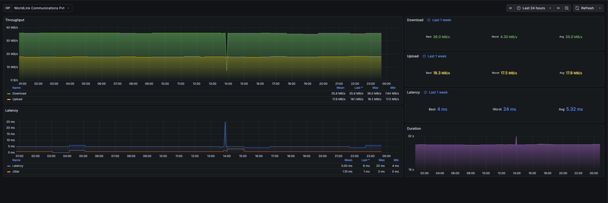

A [Speedtest](https://www.speedtest.net) exporter for Prometheus.

[](https://github.com/adityathebe/speedtest-exporter/releases)
[](https://ghcr.io/adityathebe/speedtest-exporter)

## 

## Exported Metrics

```
# HELP speedtest_up Was the last speedtest successful.
# TYPE speedtest_up gauge

# HELP speedtest_scrape_duration_seconds Time to perform last speed test
# TYPE speedtest_scrape_duration_seconds gauge

# HELP speedtest_latency_milliseconds Measured latency on last speed test in milliseconds
# TYPE speedtest_latency_milliseconds gauge

# HELP speedtest_jitter_milliseconds Measured jitter on last speed test in milliseconds
# TYPE speedtest_jitter_milliseconds gauge

# HELP speedtest_download_speed_bytes_per_second Last download speedtest result
# TYPE speedtest_download_speed_bytes_per_second gauge

# HELP speedtest_upload_speed_bytes_per_second Last upload speedtest result
# TYPE speedtest_upload_speed_bytes_per_second gauge
```

**Acknowledgments:** This project is built upon [danopstech/speedtest_exporter](https://github.com/danopstech/speedtest_exporter).
